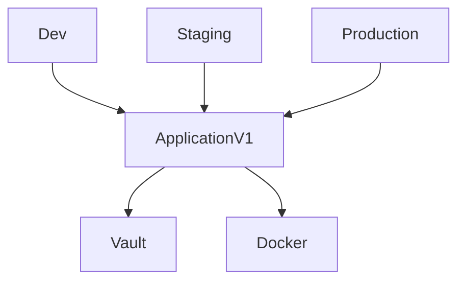

# Design Decisions

This document describes the design decisions that have been made for the Terraform code in this repository.

## Terraform

### Module Organization

The Terraform code is organised into modules. The modules are organised by the type of resource they create.

The general architecture is as follows:

We must make a distinction between the components that are used to instantiate the infrastructure (`Dev`, `Staging`, `Production`) and the modules that are used to actually create the infrastructure:

| Module        | Type        | Description                                                            | Improvements                                                                                                |
|---------------|-------------|------------------------------------------------------------------------|-------------------------------------------------------------------------------------------------------------|
| `application` | Main module | Creates the application infrastructure.                                | Should live in an isolated repository.                                                                      |
| `vault`       | Submodule   | Creates the Vault resources that are common between each microservice. | Should live in an isolated repository if it's expected to evolve independently of the `application` module. |
| `docker`      | Submodule   | Creates the containers.                                                | Should live in an isolated repository if it's expected to evolve independently of the `application` module. |

#### Vault

The Vault module is a submodule of the `application` module. It is used to create the Vault resources that are common between each microservice (`vault_generic_secret`, `vault_policy` and `vault_generic_endpoint`). It is not expected to evolve independently of the`application` module for this small project.

#### Docker

The Docker module is a submodule of the `application` module. It is used to create the containers. It is not expected to evolve independently of the `application` module for this small project.

#### Application

The `application` module is the main module. It is used to instantiate the infrastructure for each environment.

Based in the variable `microservices_config`, it creates the resources for each microservice dynamically no matter how many microservices are defined in the configuration.

Additionally, it creates the Vault resources that are common to each microservice (`vault_audit` and `vault_auth_backend`).

### Module Requirements

Each module declares in its `versions.tf` file the minimum version of Terraform and the specific provider that are required to run it.

### Live Infrastructure

The live infrastructure is defined in the `infra-live` directory. Each environment is defined in a separate directory. The directory name is the name of the environment.

This stategy allows to easily add new environments without having to modify the modules. Moreover, if any of the environments needs a specific version of the infrastructure, it can be easily achieved by referencing the appropriate tag in the `source` attribute of the `module` block. This allows to evolve the infrastructure without breaking the existing environments, and roll back to a previous version if needed. The purpose here is to follow **GitOps** principles as close as possible.

As mentioned in the `Improvements` column of the table above, the `application` module should live in an isolated repository. This would allow to reference a specific version of the module in the `source` attribute of the `module` block. It has been decided to keep the `application` module in this repository for the sake of simplicity of this project.
